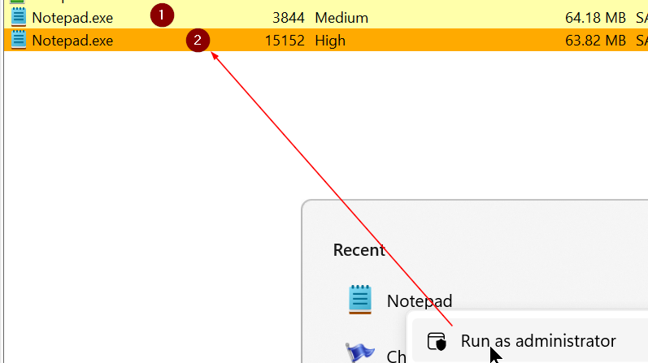
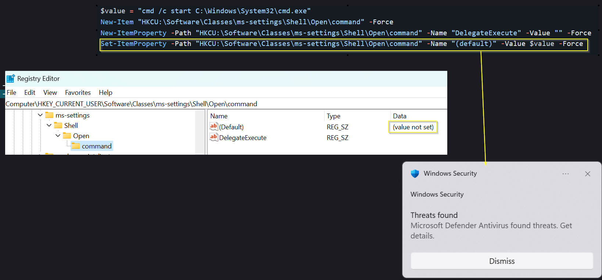
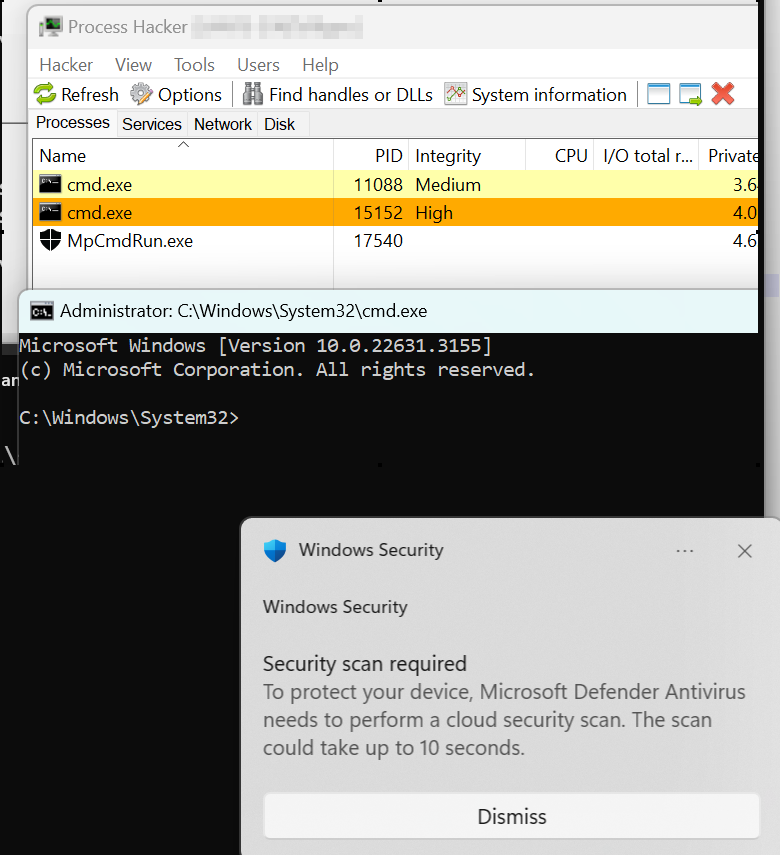

# FodHelper: are you still around?


I thought that Microsoft managed to solve this weakness, even if in my opinion, MS has not treated it as a proper vulnerability.
The matter regards UAC and related IL, if you dont' know the subject I suggest to have a look at https://www.cobaltstrike.com/blog/user-account-control-what-penetration-testers-should-know.
Here I'm going to test the weakness in a Windows 11 machine, having Defender updated ad activated. If you search the Internet for <b>fodhelper</b>, you will find a lot of intersting explanation and some PS script ready to use. Anyway I decided to try my own implementation in C#, mainly for fun, but actually there is another reasono that we will see. Just keep reading.

## A brief explanation of the test scenario
- The logged user is an administrator of the machine where UAC is enabled with the default settings, that is to say: <b>notify me only when apps try to macke changes to the computer</b>. So my user recevide 2 differents tokens to interact with Appinfo Service (UAC, to simplify)
    - Filtered Token: without administrator privileges, used for regular operations. This token has Medium integrity level (IL)
    - Elevated Token: with full administrator privileges, used when something needs to be run with hogher privileges, of course this token as High integrity level

Let's look what happens opening the good old notepad:


Here I have opened 2 istances of notepad, the second (orange) has been run as an Administrator, of course the UAC pop up asked to confirm. What does it means? It means that even if we have compromised a system with an administrative account, probably having a shell, this shell will run with a medium IL, preventig us to perform actions that requires high IL.

It comes in help, as the name implies :), FodHelper.exe. This techinique is quite old: https://winscripting.blog/2017/05/12/first-entry-welcome-and-uac-bypass, but as we will see, still working.
FodHelper is one of those windows programs that are allowed to run with an high IL, without requiring the user's interaction. This is possible thanks to a feature called auto elevation. Here there is a non-exhaustive list of auto-elevating applications in Windows 10: https://gist.github.com/TheWover/b5a340b1cac68156306866ff24e5934c.
The process is very well explained in the winscripting blog, but to cut the long story short, once executed FodHelper searches for 2 keys in the user registry:
- HKCU:\Software\Classes\ms-settings\shell\open\command\DelegateExecute
- HKCU:\Software\Classes\ms-settings\shell\open\command\(Default)

The last key is the one really interesting, since if we set the value to execute a program (e.g. a shell), the program will be executed with the inherited privileges of FodHelper, that means high IL, so if we are able to set those 2 kerys with the respective values, we can bypass UAC IL.
That's sound great, so lets try to test it using PS:
```powershell
$value = "cmd /c start C:\Windows\System32\cmd.exe"
New-Item "HKCU:\Software\Classes\ms-settings\Shell\Open\command" -Force
New-ItemProperty -Path "HKCU:\Software\Classes\ms-settings\Shell\Open\command" -Name "DelegateExecute" -Value "" -Force
Set-ItemProperty -Path "HKCU:\Software\Classes\ms-settings\Shell\Open\command" -Name "(default)" -Value $value -Force
```
But upon the execution of the last command, when we set the default value, Defender kill the PS process and the value is not set

Investigating further it seems that Defender will block any value containig the words cmd and powershell (probably there are others). If it is only a matter to bypass those filters, 
it should be quite easy indeed since the .exe string seems to be allowed.
So for this POC I created a C# console app that performs the following actions once executed:
1. Set the registry keys
2. Set the value for the Default key to execute itself, passing a random paramiter (you can pass what you want). So for istance, assuming that the name of the app is FodHlp_Elv.exe and that it is executed from the folder C:\Users\Public, the value set will be <b>C:\Users\Public\FodHlp_Elv.exe 0</b>
3. Execute FodHelper.exe, that will execute our app passing a parameter. If the app recive a parameter it will execute the payload, in our case a powershell or cmd shell.

So if you execute the app without any parameter it will set up the registry keys, indeed if you pass a parameter it will execute the shell. The workflow is:

Set up the registry --> Call FodHelper{Execute the app passing a paramter} --> Execute the shell

Actually Defender will warn us that need to scan the file, but the execution is not prevented (of course at the moment: January 2024, as we can see we got an elevated shell.




Compile the file

    "C:\Program Files\Microsoft Visual Studio\2022\Community\MSBuild\Current\Bin\Roslyn\csc.exe" Program.cs -out:FodHlp_Elv.exe

## Update feburary 2024
After executing the app 3 times actually Defender warns of a malware and eventually remove it, but the shell is spawned yet. Recompiling the file and performing a scan with Defender yet nothing is found, so probably
a behavioral blocking takes place, need to investigate deeper the matter.

## Update march 2024
Eventually comes <b>ProgID</b>
After searching a bit I found that the it is possible to completely bypass Defender (of course, at the moment of writing), using different registry key, precisely CurVer (that we can guess it means Current version). The idea is very well
explained in this post: https://v3ded.github.io/redteam/utilizing-programmatic-identifiers-progids-for-uac-bypasses, and can be summarized as follows:

ProgID (programmatic identifier) is a registry entry that can be associated with a Class ID (CLSID ), a global unique identifier for COM (Component Object Model) class object. The ProgID is basically a string such as <i>my-application.xxxxx</i> that represents a CLSID such as <i>{F9043C85-F6F2-101A-A3C9-08002B2F49FB}</i>. More information can be read at: https://learn.microsoft.com/en-us/windows/win32/shell/fa-progids.
One of the subkeys that can be set in ProgID is CurVer. CurVer entry is used to set the default version of a COM application, if multiple other versions are found on the system, e.g. set version 1.2 of my-application.xxxxx as default over version 1.1.
We can abuse this feature to make a temporary version of the <b>Shell subkey</b> to point to our malicious app (this assembly), then we can set the CurVer subkery in <b>ms-settings</b> with the value corresponding to the ProgID string. It could be sound a bit complicated in theory, but if you look at the [code](ProgramNG.cs), it will be more understandable.
You can compile the code as follows:

    "C:\Program Files\Microsoft Visual Studio\2022\Community\MSBuild\Current\Bin\Roslyn\csc.exe" ProgramNG.cs -out:FodHlpElv_NG.exe


